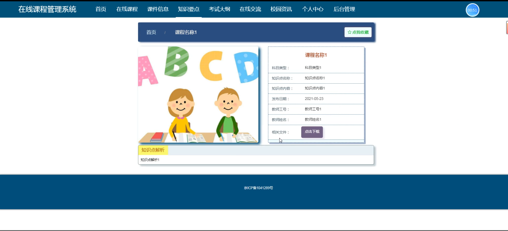
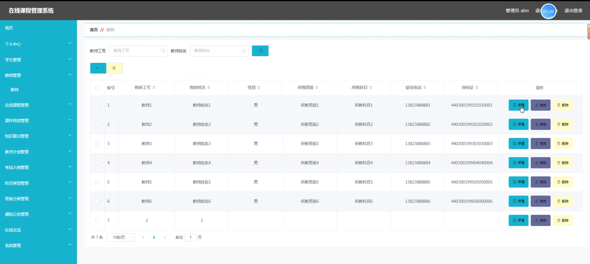

# 基于springboot的在线课程管理系统

---
### 👉作者QQ ：1556708905 微信：zheng0123Long (支持定制修改、部署调试、定制毕设)

### 👉接网站建设、小程序、H5、APP、各种系统等

---

#### 介绍

基于Spring Boot的在线课程管理系统，旨在为教育机构和学习者提供一个高效、便捷的学习和教学平台。系统设计了管理端、教师端和学生端三种角色，分别满足不同用户的需求和功能。通过综合管理学生、教师、课程及相关教学资源，系统致力于提升在线教育的质量和效率，构建一个现代化的教育生态体系。

#### 技术栈

后端技术栈：Springboot+Mysql+Maven

前端技术栈：Vue+Html+Css+Javascript+ElementUI

开发工具：Idea+Vscode+Navicate

#### 系统功能介绍

管理端功能模块  
个人中心：管理人员可以查看和更新个人信息、修改密码、接收系统通知等。  
学生管理：包括学生信息的添加、修改、删除和查看，支持批量导入学生数据。  
教师管理：包括教师信息的添加、修改、删除和查看，支持批量导入教师数据。  
在线课程管理：管理所有在线课程的信息，包括课程的创建、修改、删除和查看。  
课件信息管理：管理课程相关的课件资料，包括上传、下载、修改和删除课件。  
知识要点管理：管理课程中的知识要点，支持添加、修改、删除和查看知识要点。  
教学计划管理：制定和管理教学计划，包括课程安排、教学进度和时间表等。  
考试大纲管理：管理各科目的考试大纲，支持创建、修改、删除和查看。  
科目类型管理：管理课程的科目分类，包括添加、修改、删除和查看科目类型。  
班级分类管理：管理学生班级分类信息，包括班级的创建、修改、删除和查看。  
通知公告管理：发布和管理系统通知和公告，确保重要信息及时传达。  
在线交流：管理系统内的交流和讨论板块，促进教师和学生的互动交流。  
系统管理：包括系统设置、权限管理、日志查看、数据备份和恢复等。  

教师端功能模块  
在线课程：查看和管理自己教授的在线课程，包括课程内容和进度。  
课件信息：上传、下载和管理课程相关的课件资料。  
知识要点：管理课程中的知识要点，方便学生理解和复习。  
考试大纲：查看和管理课程相关的考试大纲，制定考试范围和内容。  
在线交流：参与和管理系统内的讨论和交流，与学生互动。  
校园资讯：查看学校发布的最新资讯和动态。  
个人中心：查看和更新个人信息、修改密码、接收系统通知等。  
后台管理：  
在线课程管理：管理自己教授的在线课程信息。  
课件信息管理：上传和管理课程相关的课件资料。  
知识要点管理：管理课程中的知识要点。  
教学计划管理：制定和管理课程的教学计划。  
考试大纲管理：管理和查看课程的考试大纲。  
学生提问管理：查看和管理学生的提问，进行回答和讨论。  
提问解答管理：解答学生提出的问题，支持在线互动。  

学生端功能模块  
在线课程：查看并参与学习已注册的在线课程，跟踪学习进度。  
课件信息：下载和查看课程相关的课件资料，辅助学习。  
知识要点：查看课程中的知识要点，帮助理解和复习。  
考试大纲：查看课程相关的考试大纲，了解考试范围和重点。  
在线交流：参与系统内的讨论和交流，向教师和同学提问。  
校园资讯：查看学校发布的最新资讯和动态。  
个人中心：查看和更新个人信息、修改密码、接收系统通知等。  
后台管理：  
学生提问管理：向教师提出学习中的问题，查看已提出的问题和答案。  
提问解答管理：查看教师和同学的回答和讨论，进行在线互动。  

#### 系统作用

该在线课程管理系统的主要作用包括：  

提升教学效率：通过系统化的管理，提升教学资源的利用率，简化教学管理流程，提高教学效率。  
促进互动交流：系统内的在线交流和提问解答功能，促进了教师与学生之间的互动，提升了学习效果。  
资源共享与管理：课件、知识要点、考试大纲等资源的统一管理和共享，提高了资源的利用率和管理效率。  
个性化学习体验：学生可以根据自己的学习进度和需求，灵活选择和管理自己的学习内容，提升学习效果。  
信息透明化：系统提供了全面的通知公告和资讯发布功能，确保重要信息及时传达，提高信息透明度。  

#### 系统功能截图

代码结构

数据库表

登录

前台页面首页

在线课程

课件信息

知识要点

考试大纲

在线交流

个人中心

学生端后台管理

教师端在线课程

考试大纲管理

提问解答管理

管理员端学生管理

教师管理

#### 总结

基于Spring Boot的在线课程管理系统，通过全面的功能模块设计，实现了教育资源的系统化管理和高效利用。系统为管理人员、教师和学生提供了全面的功能支持，优化了教学和学习流程。通过该系统，教育机构能够更好地组织和管理教学资源，提高教学质量；教师能够更加方便地管理和教授课程，提升教学效果；学生能够灵活自主地安排学习，提升学习体验。该系统不仅提升了在线教育的效率和质量，还为构建现代化的教育生态提供了有力支持。

#### 使用说明

创建数据库，执行数据库脚本 修改jdbc数据库连接参数 下载安装maven依赖jar 启动idea中的springboot项目

后台地址：http://localhost:8080/springboot0b6e5/admin/dist/index.html

管理员  abo 密码 abo

前台地址：http://localhost:8080/springboot0b6e5/front/index.html